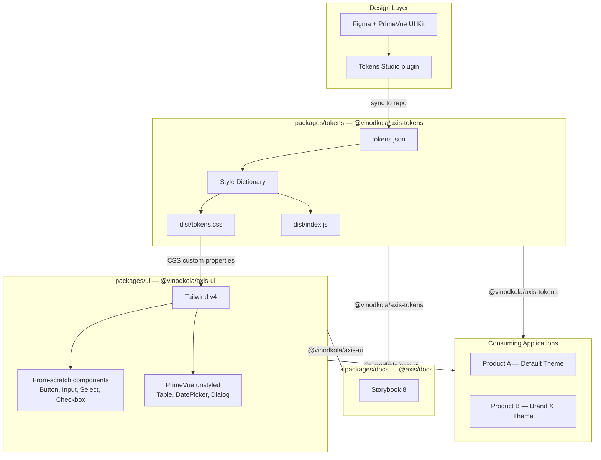
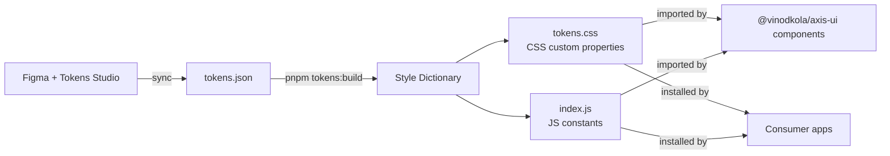
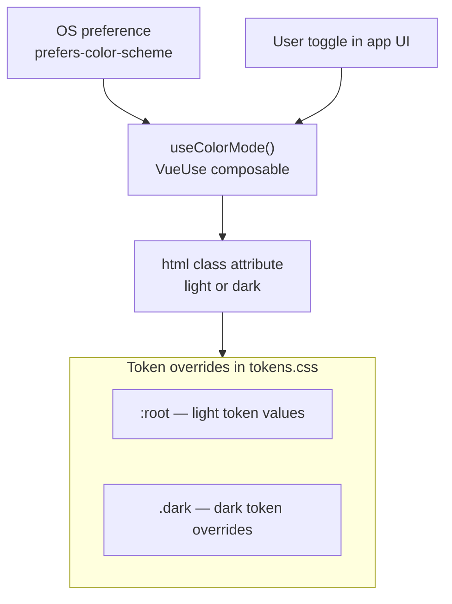
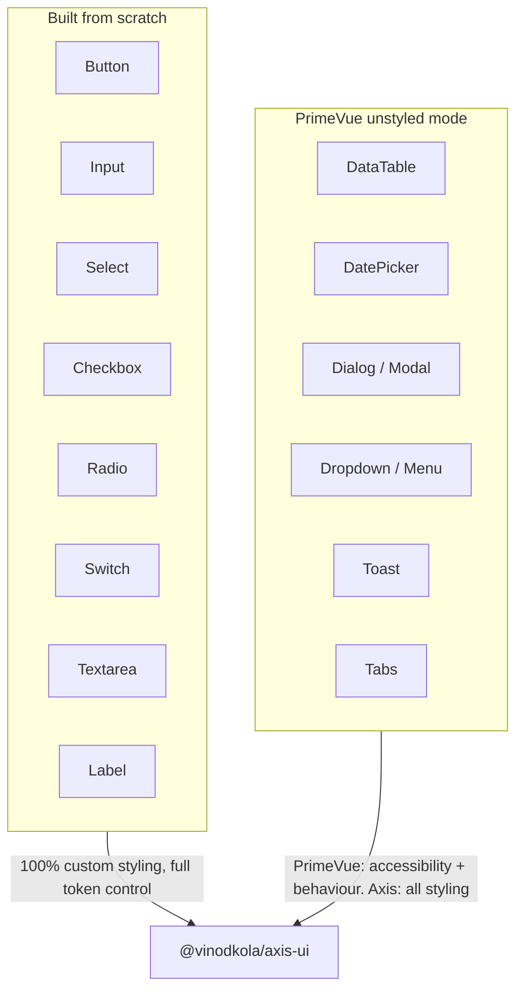

# Axis Design System — Architecture

## Overview

Axis DS is a token-driven, multi-theme design system built as a pnpm monorepo. Tokens are the single source of truth — every visual decision flows from them. Components are split between from-scratch (form elements) and PrimeVue unstyled (complex interactive components). Storybook serves as the living documentation layer.

---

## Big Picture



---

## Monorepo Structure

```
axis-design-system/
├── pnpm-workspace.yaml          ← defines workspace packages
├── package.json                 ← root scripts, shared dev dependencies
├── packages/
│   ├── tokens/                  ← @vinodkola/axis-tokens
│   │   ├── package.json
│   │   ├── tokens.json          ← source: all raw token definitions
│   │   ├── style-dictionary.config.js
│   │   └── dist/
│   │       ├── tokens.css       ← CSS custom properties (output)
│   │       └── index.js         ← JS/TS exports (output)
│   │
│   ├── ui/                      ← @vinodkola/axis-ui
│   │   ├── package.json
│   │   ├── vite.config.ts
│   │   └── src/
│   │       ├── components/
│   │       │   ├── atoms/       ← from scratch (Button, Input, Label...)
│   │       │   ├── molecules/   ← compositions (FormField, SearchBar...)
│   │       │   └── organisms/   ← PrimeVue unstyled (Table, Dialog, DatePicker...)
│   │       ├── composables/     ← shared logic (useTheme, useColorMode...)
│   │       └── index.ts         ← barrel export
│   │
│   └── docs/                    ← @axis/docs
│       ├── package.json
│       └── .storybook/
│
└── docs/                        ← non-code documentation (this file)
    ├── architecture.md
    └── learning/
```

---

## Token Pipeline

Tokens flow in one direction: design tool → source JSON → built artifacts → components.



Style Dictionary runs as a build step — locally on demand, and in CI on every push to `main`. The generated `dist/` files are committed so PR diffs show exactly what token values changed.

---

## Three-Tier Token Model

```mermaid
flowchart LR
    subgraph P["① Primitive"]
        P1["color-blue-500<br/>#3B82F6"]
        P2["color-blue-700<br/>#1D4ED8"]
        P3["spacing-4<br/>1rem"]
        P4["radius-md<br/>0.375rem"]
    end

    subgraph S["② Semantic"]
        S1["color-action-primary<br/>{color-blue-500}"]
        S2["color-action-primary-hover<br/>{color-blue-700}"]
        S3["color-text-default<br/>{color-gray-900}"]
        S4["color-surface-page<br/>{color-white}"]
    end

    subgraph C["③ Component"]
        C1["button-bg<br/>{color-action-primary}"]
        C2["button-bg-hover<br/>{color-action-primary-hover}"]
        C3["button-radius<br/>{radius-md}"]
    end

    P --> S --> C
```



**The rule:** components only reference component or semantic tokens, never primitives directly. This ensures a single primitive change cascades everywhere automatically.

---

## Dark / Light Mode

Mode switching is handled by `useColorMode()` from VueUse. It respects the OS preference by default and allows user override.



Only **semantic tokens** are overridden per theme. Primitive tokens never change. This means adding a new theme is just a new set of semantic token overrides — no component code changes.

---

## Component Strategy



PrimeVue unstyled mode gives accessibility, keyboard navigation, and ARIA for complex components for free. Axis owns 100% of the visual layer for both categories.

---

## Package Export Strategy

`@vinodkola/axis-ui` supports two import styles. Both are valid, both are tree-shaken.

```ts
// Named import — bundler tree-shakes unused components
import { Button, Input } from '@vinodkola/axis-ui'

// Subpath import — explicit, zero risk of side-effect imports
import Button from '@vinodkola/axis-ui/button'
import Input from '@vinodkola/axis-ui/input'
```

Subpath exports are defined in `packages/ui/package.json` under the `exports` field.

---

## Deployment

### npm Public Registry — Packages

`@vinodkola/axis-tokens` and `@vinodkola/axis-ui` are published publicly on npmjs.com. Each package requires:

```json
{
  "publishConfig": { "access": "public" },
  "files": ["dist"]
}
```

`publishConfig` is required — scoped packages default to private without it. `files` ensures only `dist/` is shipped, not source, config, or stories.

```
pnpm --filter @vinodkola/axis-tokens publish
pnpm --filter @vinodkola/axis-ui publish
```

### Vercel — Storybook

`packages/docs` builds to a static site and is hosted on Vercel's free plan. Since Storybook depends on `@vinodkola/axis-ui` and `@vinodkola/axis-tokens` being built first, Vercel runs from the repo root.

| Setting | Value |
|---|---|
| Root directory | `/` |
| Build command | `pnpm run tokens:build && pnpm --filter @vinodkola/axis-ui build && pnpm --filter @axis/docs build-storybook` |
| Output directory | `packages/docs/storybook-static` |
| Install command | `pnpm install` |

Every branch gets a preview deployment URL automatically — useful for reviewing component changes before merging to `main`.

---

## How Consumers Install Axis DS

```ts
// Install
// pnpm add @vinodkola/axis-tokens @vinodkola/axis-ui

// In app entry (main.ts)
import '@vinodkola/axis-tokens/dist/tokens.css'   // load all CSS custom properties

// Per component
import { Button } from '@vinodkola/axis-ui'
```

For multi-theme consumers: load the appropriate theme override file after the base tokens.

```ts
import '@vinodkola/axis-tokens/dist/tokens.css'         // base (light)
import '@vinodkola/axis-tokens/dist/theme-brandx.css'   // override semantic tokens
```
