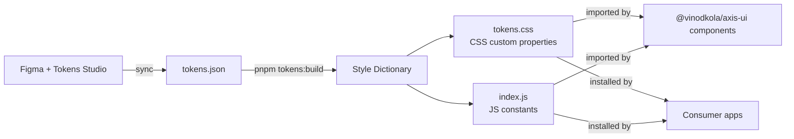
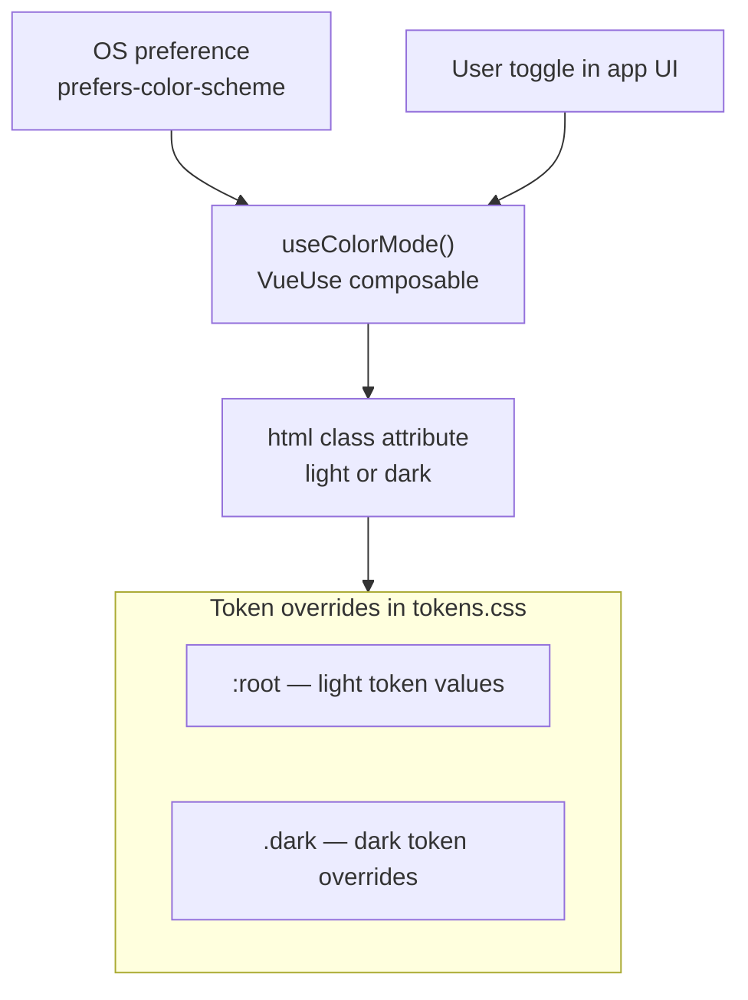

# Axis Design System — Architecture

## Overview

Axis DS is a token-driven, multi-theme design system built as a pnpm monorepo. Tokens are the single source of truth — every visual decision flows from them. Components are split between from-scratch (form elements) and PrimeVue unstyled (complex interactive components). Storybook serves as the living documentation layer.

---

## Big Picture


---

## Monorepo Structure

```
axis-design-system/
├── pnpm-workspace.yaml          ← defines workspace packages
├── package.json                 ← root scripts, shared dev dependencies
├── packages/
│   ├── tokens/                  ← @vinodkola/axis-tokens
│   │   ├── package.json
│   │   ├── style-dictionary.config.js
│   │   ├── tokens/
│   │   │   ├── primitive.json   ← raw values (colors, spacing, type scale)
│   │   │   ├── semantic.json    ← purpose-mapped aliases (background, text, border)
│   │   │   └── component.json  ← component-level tokens (button-height, text-input-radius)
│   │   └── dist/
│   │       ├── tokens.css       ← CSS custom properties (output)
│   │       └── index.js         ← JS/TS exports (output)
│   │
│   ├── ui/                      ← @vinodkola/axis-ui
│   │   ├── package.json
│   │   ├── vite.config.ts
│   │   ├── tsconfig.json
│   │   └── src/
│   │       ├── components/      ← per-component folders (button, text-input, table, dialog...)
│   │       ├── styles/
│   │       │   └── main.css     ← Tailwind v4 entry + @theme inline token mapping
│   │       └── index.ts         ← barrel export (also imports main.css)
│   │
│   └── docs/                    ← @axis/docs
│       ├── package.json
│       └── .storybook/
│
└── docs/                        ← non-code documentation (this file)
    ├── architecture.md
    └── learning/
```

---

## Token Pipeline

Tokens flow in one direction: design tool → source JSON → built artifacts → components.



Style Dictionary runs as a build step — locally on demand, and in CI on every push to `main`. The generated `dist/` is gitignored; token change diffs are visible in the source JSON files.

---

## Three-Tier Token Model

```mermaid
flowchart LR
    subgraph P["① Primitive"]
        P1["color-blue-500<br/>#3B82F6"]
        P2["color-blue-700<br/>#1D4ED8"]
        P3["spacing-4<br/>1rem"]
        P4["radius-md<br/>0.375rem"]
    end

    subgraph S["② Semantic"]
        S1["color-action-primary<br/>{color-blue-500}"]
        S2["color-action-primary-hover<br/>{color-blue-700}"]
        S3["color-text-default<br/>{color-gray-900}"]
        S4["color-surface-page<br/>{color-white}"]
    end

    subgraph C["③ Component"]
        C1["button-bg<br/>{color-action-primary}"]
        C2["button-bg-hover<br/>{color-action-primary-hover}"]
        C3["button-radius<br/>{radius-md}"]
    end

    P --> S --> C
```



**The rule:** components only reference component or semantic tokens, never primitives directly. This ensures a single primitive change cascades everywhere automatically.

---

## Dark / Light Mode

Mode switching is handled by `useColorMode()` from VueUse. It respects the OS preference by default and allows user override.



Only **semantic tokens** are overridden per theme. Primitive tokens never change. This means adding a new theme is just a new set of semantic token overrides — no component code changes.

---

## Component Strategy

All components live in per-component folders under `src/components/` — no atomic hierarchy. Components are grouped by public component name, with each folder owning its Vue implementation, local exports, and future component-specific files.

| From scratch | PrimeVue unstyled |
|---|---|
| Button, TextInput, Select, Checkbox, Radio, Switch, Textarea, Label | Table, DatePicker, Dialog, Dropdown, Toast, Tabs |

PrimeVue unstyled mode provides accessibility, keyboard navigation, and ARIA for complex components. Axis owns 100% of the visual layer for both groups.

**Decision:** Per-component folders were chosen over atomic (atoms/molecules/organisms) because the atom/molecule boundary is subjective and causes maintenance friction as a system grows. Consumers look for components by name, not composition depth.

---

## Icon Strategy

Axis uses `@lucide/vue` as the standard product icon library through the Axis `Icon` component. Lucide owns the SVG paths; Axis owns presentation through tokens. Icons inherit `currentColor` by default and use `--axis-icon-*` component tokens for size and stroke treatment.

Product code should pass imported Lucide components to `Icon` with the `icon` prop, such as `<Icon :icon="Search" />`. A string-name registry is intentionally deferred until the icon vocabulary stabilizes; direct imports keep the API low-maintenance and tree-shakable.

Icon keeps accessibility behavior lightweight: native attributes fall through to the root element, and the internal SVG is marked `aria-hidden`. Standalone meaningful icons can pass attributes such as `role="img"` with `aria-label` or `aria-labelledby`; icons inside controls rely on the owning control's accessible name.

Storybook documents icon usage under `Styles/Icons` instead of a separate `Components/Icon` page. `Icon` is still a public component, but it is a thin styling wrapper over Lucide; the consumer decision is usually iconography guidance, token behavior, and accessibility rather than component composition.

PrimeIcons remains acceptable for PrimeVue-backed internals when a Prime component expects it, but product-facing Axis documentation and examples should prefer Lucide through `Icon` for visual consistency and SVG-level control.

---

## Component CSS Class Naming

Axis component styles use a BEM-style class naming convention with an `axis-` namespace:

```css
.axis-text-input {}
.axis-text-input__control {}
.axis-text-input--invalid {}
```

- **Block:** the standalone component root, such as `axis-text-input`.
- **Element:** an internal part of the component, separated with `__`, such as `axis-text-input__control`.
- **Modifier:** a variant or state, separated with `--`, such as `axis-text-input--invalid`, `axis-text-input--fluid`, or `axis-text-input--sm`.

This keeps component CSS readable, scoped by convention, and predictable without relying on vague global names like `.input`, `.error`, or `.large`. The `axis-` prefix avoids collisions with consumer application styles.

This convention is separate from CSS custom properties. Token variables such as `--axis-text-input-color-bg` also start with `--`, but that is required CSS syntax for custom properties, not BEM.

---

## Tailwind v4 + Token Integration

Tailwind v4 uses CSS-first configuration — no `tailwind.config.js`. The integration with axis-tokens is done in `src/styles/main.css` via two directives:

```css
@theme {
  --color-*: initial;       /* reset Tailwind's default color palette */
}

@theme inline {
  --color-interactive: var(--axis-color-interactive-primary);
  --color-text: var(--axis-color-text-primary);
  /* ... all semantic tokens mapped */
}
```

**`@theme` (without `inline`)** — resets Tailwind's built-in colors. This enforces that developers can only use axis semantic token names as utility classes (`bg-interactive`, `text-text-secondary`), not Tailwind's default palette (`bg-blue-500`).

**`@theme inline`** — maps axis CSS vars to Tailwind's utility namespace without resolving the values at build time. The `var()` references are kept as-is in the output. At runtime the browser resolves them against whatever `tokens.css` defines on `:root`.

**CSS output split:** `dist/style.css` (built by Vite) contains Tailwind utilities. `dist/tokens.css` (from packages/tokens) contains the CSS custom property values. Consumers must import both — the UI CSS depends on the token vars being present in the document.

**Tree-shaking:** Tailwind v4 only emits a utility class if it's actually used in the source files scanned by the Vite plugin. An unused `bg-error` never appears in the output bundle.

---

## Package Export Strategy

`@vinodkola/axis-ui` supports two import styles. Both are valid, both are tree-shaken.

```ts
// Named import — bundler tree-shakes unused components
import { Button, TextInput } from '@vinodkola/axis-ui'

// Subpath import — explicit, zero risk of side-effect imports
import Button from '@vinodkola/axis-ui/button'
import TextInput from '@vinodkola/axis-ui/text-input'
```

Subpath exports are defined in `packages/ui/package.json` under the `exports` field.

---

## Deployment

### npm Public Registry — Packages

`@vinodkola/axis-tokens` and `@vinodkola/axis-ui` are published publicly on npmjs.com. Each package requires:

```json
{
  "publishConfig": { "access": "public" },
  "files": ["dist"]
}
```

`publishConfig` is required — scoped packages default to private without it. `files` ensures only `dist/` is shipped, not source, config, or stories.

```
pnpm --filter @vinodkola/axis-tokens publish
pnpm --filter @vinodkola/axis-ui publish
```

### Vercel — Storybook

`packages/docs` builds to a static site and is hosted on Vercel's free plan. Storybook consumes UI component and global CSS source directly, while `@vinodkola/axis-tokens` must be built first because its generated CSS variables are imported by the preview.

Component stories are colocated with their Vue components under `packages/ui/src/components`, while `packages/docs` remains the private Storybook host. Stories import local `.vue` source directly for reliable docgen, and the docs Vite config processes the UI package's source-level global CSS with the same Vue and Tailwind plugins used by the library.

Storybook Docs uses the native `docs.toc` parameter from `@storybook/addon-docs` for page navigation. The global preview includes `h2` and `h3` headings so component documentation sections and subsections appear without adding a third-party TOC addon. Individual component metadata may disable or refine the TOC for exceptional pages.

Component documentation uses colocated MDX pages in this standard order: Overview, Usage, Variants, API, and Accessibility. One common interactive example appears directly after the Overview paragraph without its own heading. The Docs page is the complete component guideline, so there is no separate Guidelines section. Usage combines concise best-practice bullets with a short Use/Avoid table, while related variants, sizes, or states are shown together in comparison stories rather than one Docs Canvas per option. Each option family includes a one-line description of its controlling prop and a compact decision table, and supported disabled states are documented under Variants for discoverability. Grouped comparison stories use Storybook's `!dev` tag so they remain available to MDX without appearing as standalone development stories in the sidebar.

Button separates visual hierarchy from action intent. The `emphasis` prop controls prominence (`filled`, `outlined`, or `text`), while the `severity` prop controls intent (`primary` or `danger`). This keeps supporting actions such as Back or Cancel as lower-emphasis buttons rather than treating them as separate semantic severities.

Button owns standard icon rendering through `label`, `icon`, and `iconPosition` props. When `icon` is provided without a visible label, Button infers icon-only mode and applies square sizing equal to the tokenized button height. Icon-only buttons rely on native `aria-label` fallthrough for their accessible name instead of a component-specific accessibility prop.

Custom MDX pages attach to colocated story metadata with Storybook's `Meta` block. Individual stories remain available in the sidebar for development, but Docs pages embed only the common example and grouped stories that help consumers make design decisions. Once a custom MDX page exists, its story metadata must remove the `autodocs` tag to prevent duplicate Docs entries.

Storybook globally excludes Vue framework metadata (`key`, `ref`, `ref_for`, and `ref_key`) plus generic `class` and `style` fallthrough attributes from Controls and generated ArgTypes tables. These values are not component-owned public API; native attribute fallthrough is described in prose where relevant.

API tables use Storybook Doc Blocks and Vue metadata so props, slots, and emitted events are not duplicated manually. Accessibility always covers screen-reader behavior and keyboard support. Component-level version history is excluded; release history belongs in the future package changelog and standalone Release Notes page.

Because MDX files live in `packages/ui` while Storybook dependencies live in private `packages/docs`, the docs Vite config resolves the Doc Blocks entrypoint from the host package. It also normalizes Storybook's generated `file://` MDX imports on Windows. This preserves package boundaries without adding Storybook runtime dependencies to the published UI package.

The docs host enables `remark-gfm` through Storybook's MDX compile options. Component authors can use concise GitHub-Flavored Markdown tables instead of verbose HTML table markup.

Storybook preview styles make documentation tables fill the available Docs content width. This keeps comparison and guidance tables visually consistent regardless of their text length.

| Setting | Value |
|---|---|
| Root directory | `/` |
| Build command | `pnpm run storybook:build` |
| Output directory | `packages/docs/storybook-static` |
| Install command | `pnpm install` |

Every branch gets a preview deployment URL automatically — useful for reviewing component changes before merging to `main`.

---

## Design Guidelines

Axis DS follows **Material Design 3 (MD3)** as its primary design guideline reference. This is a *principles* decision, not a components decision — we don't use Google's Material components; we use MD3's documented thinking on color roles, elevation, motion, typography, and accessibility as the foundation for our own decisions.

**Why MD3:**
- The most detailed, publicly documented design system spec available
- Color role model (`surface`, `on-surface`, `primary`, `on-primary`…) maps closely to the three-tier token model already in use
- Covers accessibility, motion, and component behavior — areas most in-house systems leave undocumented

**What we follow from MD3:**
- Color role naming and relationships (adapted to our `color.background`, `color.surface`, `color.text` naming)
- Elevation model — shadows and surface layering
- Typography scale and role assignments (display, headline, body, label)
- Component interaction states (hover, pressed, focused, disabled) and their token formulas
- Accessibility contrast ratios (minimum 4.5:1 for text, 3:1 for UI elements)

**What we diverge from:**
- MD3 uses its own naming convention (`colorScheme.primary`, `colorScheme.onPrimary`); Axis uses a more readable noun-based naming (`color.interactive.primary`, `color.text.inverse`)
- MD3 targets Material You / adaptive theming; Axis targets product design systems with explicit theme files

**Alternatives considered:**

| System | Strength | Why not primary reference |
|---|---|---|
| Material Design 3 | Most complete spec, color roles, motion | ✓ Chosen |
| Apple HIG | Native Apple UX patterns | Web-focused, less applicable |
| Fluent Design (Microsoft) | Enterprise, Windows ecosystem | Less community tooling |
| Atlassian Design System | Practical enterprise patterns | Proprietary, product-specific |
| Carbon (IBM) | Accessibility-first, data-heavy UIs | Data-product bias |

---

## How Consumers Install Axis DS

```ts
// Install
// pnpm add @vinodkola/axis-tokens @vinodkola/axis-ui

// In app entry (main.ts)
import '@vinodkola/axis-tokens/dist/tokens.css'   // 1. CSS custom property values (:root)
import '@vinodkola/axis-ui/style.css'             // 2. Tailwind utilities + component styles

// Per component
import { Button } from '@vinodkola/axis-ui'
```

Order matters: tokens.css must load first. The UI style.css references `var(--axis-*)` — those vars must be defined before the utilities are applied.

For multi-theme consumers: load the appropriate theme override file after the base tokens.

```ts
import '@vinodkola/axis-tokens/dist/tokens.css'         // base (light)
import '@vinodkola/axis-tokens/dist/theme-brandx.css'   // override semantic tokens
```
