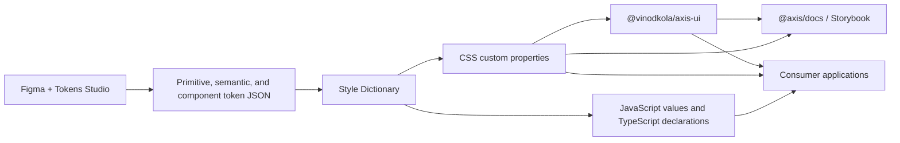

# Axis Design System - Architecture Overview

Axis separates the system into token, component, and documentation layers. Tokens define visual decisions, Vue components apply them, and Storybook documents and tests the resulting public APIs.

The system is built with Vue 3, TypeScript, Tailwind CSS, Style Dictionary, Storybook 10, and pnpm workspaces. Its public token and UI packages are developed together while remaining independently consumable by applications.

## System Flow



## Repository Structure

```text
axis-design-system/
|-- packages/
|   |-- tokens/       # Token sources and Style Dictionary configuration
|   |-- ui/           # Vue components, styles, stories, and component MDX
|   `-- docs/         # Private Storybook host and browser-test configuration
|-- docs/
|   |-- architecture/ # Architecture gateway and domain decisions
|   |-- learning/     # Learning notes, not mandatory implementation context
|   |-- component-documentation.md
|   `-- spec.md
|-- AGENTS.md         # Universal model instructions and context routing
|-- package.json
`-- pnpm-workspace.yaml
```

## System Boundaries

Axis is a pnpm workspace with three packages:

| Package | Responsibility | Publication |
|---|---|---|
| `@vinodkola/axis-tokens` | Token sources and Style Dictionary outputs | Public |
| `@vinodkola/axis-ui` | Vue components and shared styles | Public |
| `@axis/docs` | Storybook documentation and browser tests | Private |

Tokens are the source of truth for visual decisions. The UI package consumes them, Storybook documents and tests the UI package, and consumer applications install the public packages.

## Core Decisions

- Visual values flow through primitive, semantic, and component token tiers; components consume semantic or component tokens.
- Theme changes override semantic tokens rather than component implementations.
- Public components are organized by component name rather than atomic-design categories.
- Axis owns component visuals; PrimeVue may provide complex unstyled behavior where appropriate.
- Stories and component documentation are colocated with UI source, while the private docs package owns Storybook runtime configuration.
- Public packages support named imports, and UI components also support subpath imports.
- Generated artifacts are build output and remain outside source control.

## Domain Routing

Read only the domain documents relevant to the task. For a decision that crosses domains, read each affected document.

| Task involves | Read |
|---|---|
| Token tiers, Style Dictionary, themes, Tailwind token mappings | `docs/architecture/tokens-and-theming.md` |
| Components, CSS conventions, adaptive layout, icons, design principles | `docs/architecture/components-and-styling.md` |
| Storybook ownership, source boundaries, docgen, documentation testing | `docs/architecture/documentation.md` |
| Package exports, consumer imports, npm publishing, versioning | `docs/architecture/packages-and-releases.md` |

Record new durable decisions in the matching domain file. Update this gateway only when a system boundary or routing category changes.
